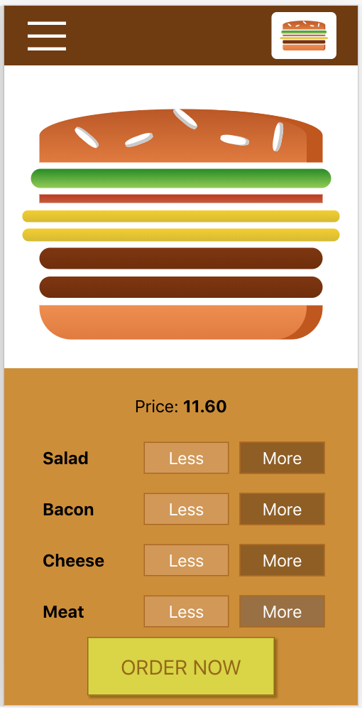
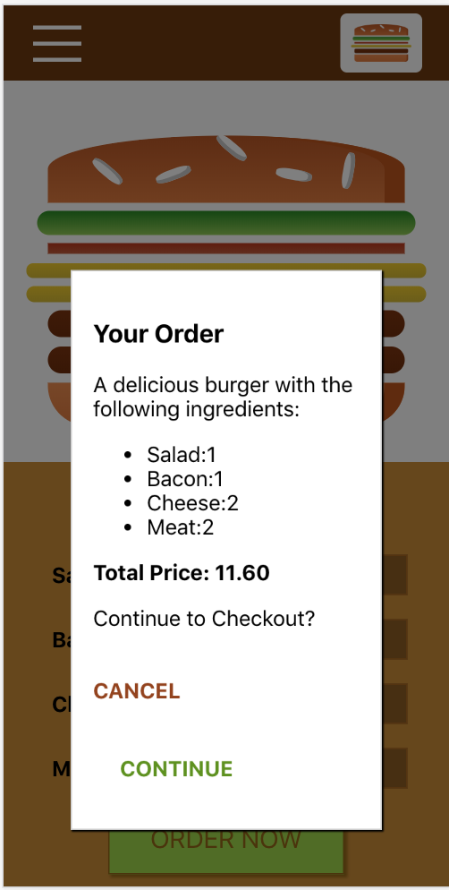

# Hamburger Builder

> Starter project from Udemy course on React + Redux. Followed along from videos in order to familiarize myself to the basic syntax of React.

### Things to note

* This project was bootstrapped with [Create React App](https://github.com/facebook/create-react-app)
* Uses css modules by default
* Stateless components are just ES6 type constants that return JSX; where state or lifecycle methods are needed, classes which extend React.Component are used
* An optimization is made in `src/components/UI/Modal/Modal.js`: the `shouldComponentUpdate()` method is called to update that component only if when it its visibility is toggled

### Screenshots

